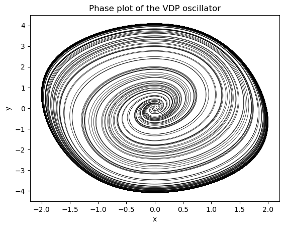

paramfittorchdemo
================

<!-- WARNING: THIS FILE WAS AUTOGENERATED! DO NOT EDIT! -->

This file will become your README and also the index of your
documentation.

## Install

``` sh
pip install paramfittorchdemo
```

## How to use

Using the integration routines in the library torchdiffeq we can
integrate differential equations using torch modules as the base class
for describing the systems. This allows for gradients to be computed
with respect to the model parameters. This can be combined with the
local optimization schemes used to train neural networks to give a
powerful framework for fitting differential equation models found in the
scientific literature.

In this package I provide a few example systems and parameter fitting
routines for fitting the parameters.

The below code demonstrates how the van der Pol oscillator system
defined as \`torch.nn.module1 can be integrated against inside of
pytorch.

``` python
import torch 
from torchdiffeq import odeint_adjoint as odeint
import matplotlib.pyplot as plt
vdp_model = VDP(mu=0.5)
ts = torch.linspace(0,30.0,1000)
# Create a batch of initial conditions 
batch_size = 30
initial_conditions = torch.tensor([0.01, 0.01]) + 0.2*torch.randn((batch_size,2))
sol = odeint(vdp_model, initial_conditions, ts, method='dopri5').detach().numpy()


# Check the solution
plt.plot(sol[:,:,0], sol[:,:,1], color='black', lw=0.5);
plt.title("Phase plot of the VDP oscillator");
plt.xlabel("x");
plt.ylabel("y");
```



The automatic batching dimensions means we can easily integrate a
collection of initial conditions at the same time using these routines
as well. The above shows the phase plane plot of the VDP oscillator for
30 random initial conditions.
