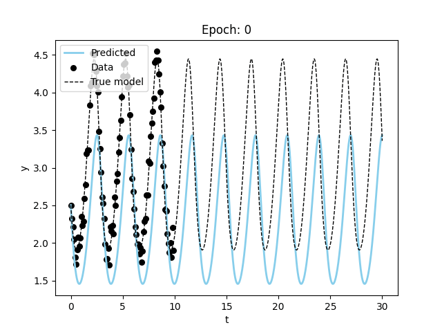

# paramfittorchdemo

<!-- WARNING: THIS FILE WAS AUTOGENERATED! DO NOT EDIT! -->

## Install

``` sh
pip install paramfittorchdemo
```

You should checkout the writeup on fitting parameters for differential
equations using pytorch
[here](https://khannay.github.io/paramfittorchdemo/training.html).

<p align="center">

</p>
<p align="center">

</p>
<p align="center">

</p>
